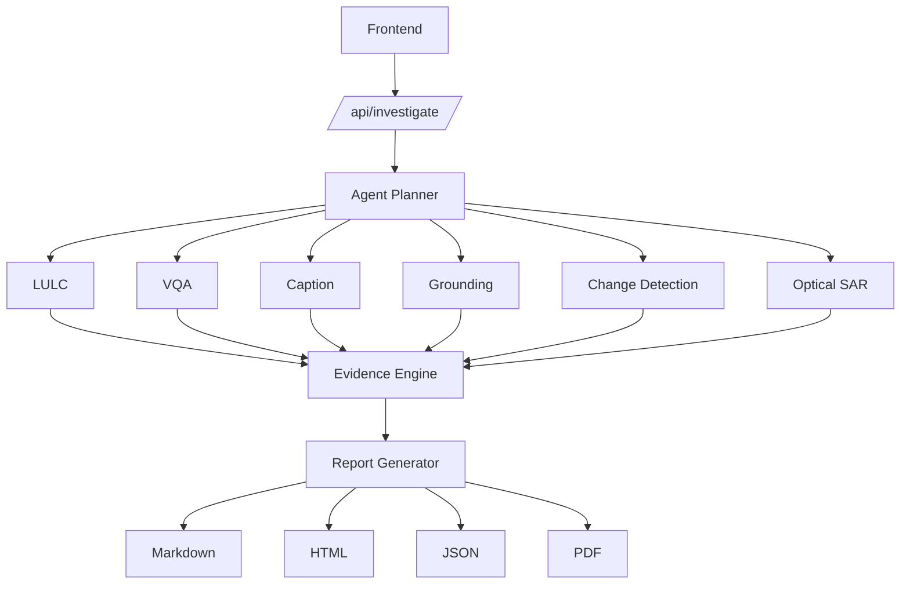

# API Documentation

## Investigation API

POST /api/investigate

Starts a remote sensing investigation.

## Real-Time Monitoring

GET /api/investigate/{job_id}/stream

Server-Sent Events:

- progress
- complete
- error
- ping

## Results

GET /api/investigate/{job_id}/result

## Validation

POST /api/validate

Validates geospatial imagery.

## Report Generation

GET /api/report/{job_id}/download

Formats:

- Markdown
- HTML
- JSON
- PDF

## Specialist APIs

POST /api/specialists/lulc

POST /api/specialists/vqa

POST /api/specialists/caption

POST /api/specialists/grounding

POST /api/specialists/change

POST /api/specialists/change-vqa

POST /api/specialists/optical-sar

## API Architecture

