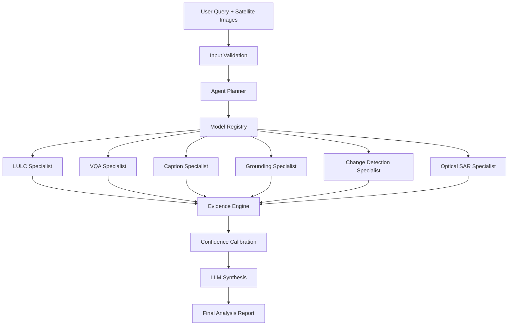

# System Architecture

## Design Philosophy

OrbiLens AI separates:

1. Planning
2. Specialist Inference
3. Deterministic Measurement
4. Response Synthesis

This ensures explainability, auditability, and reproducibility.

## Workflow

User Query
↓
Input Validation
↓
Agent Planner
↓
Model Registry
↓
Specialist Models
↓
Geospatial Tools
↓
Evidence Aggregation
↓
Confidence Calibration
↓
LLM Synthesis
↓
Final Report

## Specialist Modules

### LULC Specialist
ResNet-50 based land-use classification.

### Change Detection Specialist
BIT Transformer + Siamese ResNet-18.

### VQA Specialist
Remote sensing question answering.

### Caption Specialist
Automated scene description generation.

### Grounding Specialist
Object localization and spatial grounding.

### Cross-Modal Specialist
Optical and SAR reasoning.

## High-Level Architecture

